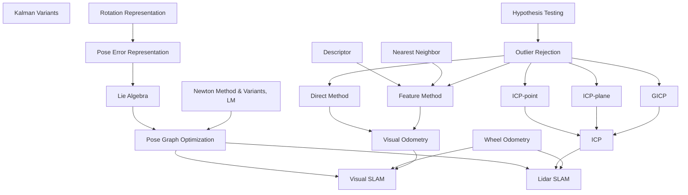

# SLAM ENGINEER
## Introduction
This is a living journey of me becoming a SLAM engineer. I will keep developing working examples, write-ups and visualization tools to help myself understanding things better. Feel free to let me know if I make any mistakes. 
## Roadmap

## reference